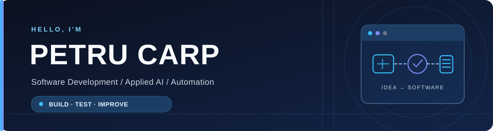

 

**Building practical software for real-world problems.**

## About me

I build software with a focus on **practical problems, clear architecture, and real-world usability**. My interests and hands-on projects span desktop applications, Android, backend systems, machine learning, and computer vision.

I enjoy taking an idea from early exploration to an implementation that can be tested, used, and improved.

## Selected work

<table>
<tr>
<td width="50%" valign="top">

### 🚘 [AVAX ALPR](https://github.com/petru-carp30/AVAX-ALPR)

**Offline-first vehicle access control**

License plate recognition for site gates, combining on-device detection and OCR with local verification, access logging, and background sync.

<b>Kotlin · CameraX · YOLOX · ML Kit · ASP.NET Core · SQL Server</b>

</td>
<td width="50%" valign="top">

### 🏢 [OrganigramGenerator](https://github.com/petru-carp30/OrganigramGenerator)

**Interactive organizational charts**

Windows desktop application for generating and editing organization charts from Excel employee data, with hierarchy validation and PDF printing.

<b>VB.NET · WPF · .NET 10 · Excel</b>

</td>
</tr>
<tr>
<td width="50%" valign="top">

### 🧠 [Lyapunov-Net](https://github.com/petru-carp30/Lyapunov-Net)

**Neural network stability research**

Experimental framework for exploring Lyapunov stability principles in nonlinear dynamical systems, including training and visualization tools.

<b>Python · PyTorch · Matplotlib</b>

</td>
<td width="50%" valign="top">

### 🔢 [Matrix](https://github.com/petru-carp30/Matrix)

**Linear algebra in C++**

Interactive console application with matrix arithmetic, determinants, inverses, transposition, and other mathematical operations.

<b>C++ · Algorithms · Linear Algebra</b>

</td>
</tr>
</table>

## Tech stack

**Languages**

**Frameworks, platforms & tools**

## What I'm exploring

- **Applied AI:** computer vision, machine learning, and intelligent tools
- **Automation:** software that reduces repetitive operational work
- **Reliable systems:** offline-first mobile apps, backend APIs, and data workflows
- **Engineering craft:** better architecture, testing, and maintainability

---

Build it. Test it. Make it better.

